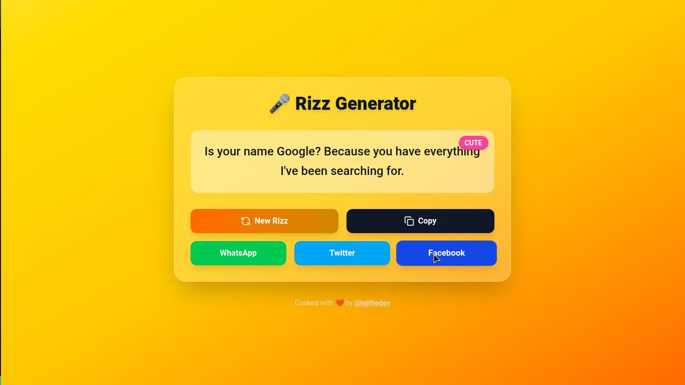

# 🎤 Rizz Generator – Test your pickup game!

Need some smooth lines to break the ice? This little app serves you random **Rizz lines** (pickup lines) with just one click. Copy them, share them, and maybe even impress someone 😉.

---

## 🚀 Live Demo

👉 [Try it here](https://rizz-generator.vercel.app/)

---

## 📸 Screenshot

> **

---

## ✨ Features

* 🎲 **Random Rizz** – get a new pickup line with one click
* 📋 **Copy to clipboard** – instantly copy a line for quick use
* 📱 **Social sharing** – share directly to Twitter, WhatsApp, and Facebook
* 🎨 **Modern UI** – clean yellow-themed design with animations
* 🌙 **Category tags** – lines are labeled (cute, funny, spicy, edgy)

---

## 🛠 Tech Stack

* ⚛️ **React** (frontend)
* 🎨 **Tailwind CSS** (styling)
* 🎭 **Framer Motion** (animations)
* 🔗 **Lucide Icons** (icons)

---

## 🖥 How to Run Locally

1. Clone this repo:

   ```bash
   git clone https://github.com/tejHacks/rizz-generator.git
   cd rizz-generator
   ```

2. Install dependencies:

   ```bash
   npm install or pnpm install
   ```

3. Start the dev server:

   ```bash
   npm run dev
   ```

4. Open in browser:

   ```
   http://localhost:5173
   ```

---

## 👨‍💻 Author

Cooked by [@tejthedev](https://github.com/tejHacks) 🍳

* 🐦 Twitter: [@OlatejuOlamid10](https://x.com/OlatejuOlamid10)
